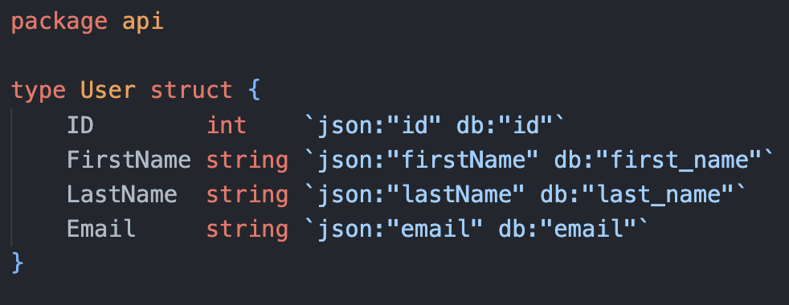
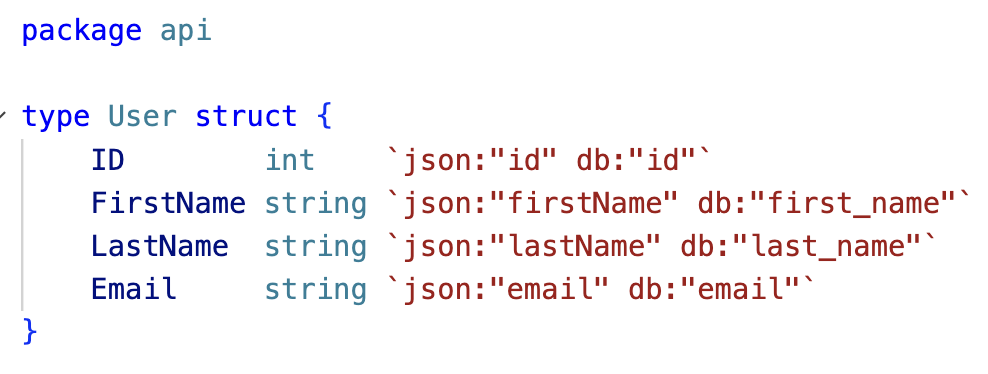
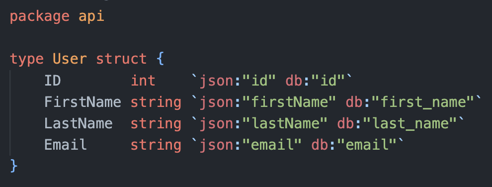
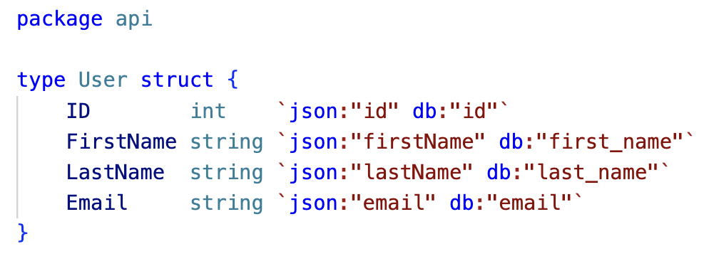
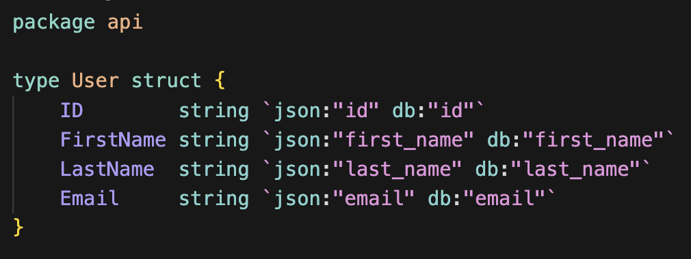
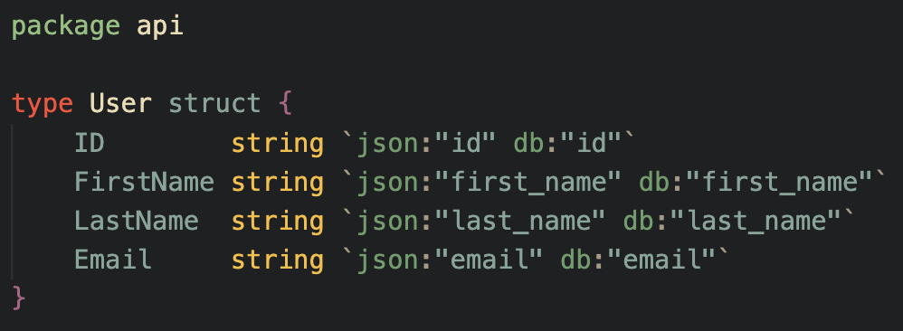
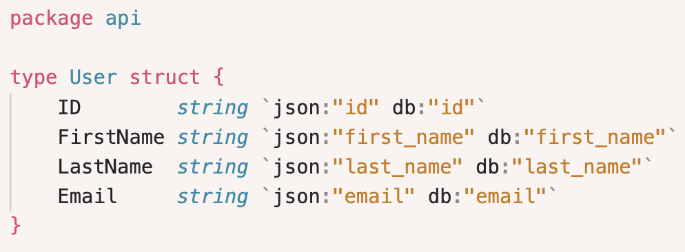
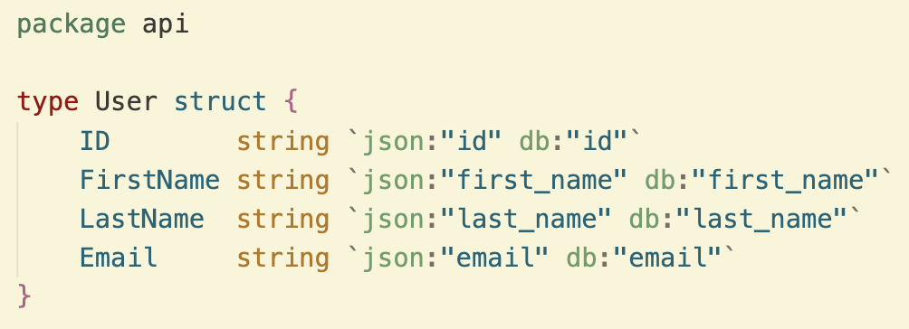

# go-struct-tag-highlighter

Go Struct Tag Highlighter is a lightweight VS Code extension that highlights Go struct tag keys using your theme's colors. You can also override the default theme colors and define your own.

__Before__

    
    

__After (user defined colors)__

    
    

__After (theme aware colors)__

    
    

    
    

## Features

- Theme aware colors.

- Highlights struct tag keys and values.

- Automatically adapts to light and dark themes.

- User-configurable colors in settings.json.

## Extension Settings

This extension contributes the following settings:

* `goStructTagHighlighter.colors.enabledCustom`: Enable custom colors for Go struct tags. If disabled, the extension will use the default theme colors.
* `goStructTagHighlighter.colors.dark.key`: Color for struct tag keys in dark mode.
* `goStructTagHighlighter.colors.dark.value`: Color for struct tag values in dark mode.
* `goStructTagHighlighter.colors.light.key`: Color for struct tag keys in light mode.
* `goStructTagHighlighter.colors.light.value`: Color for struct tag values in light mode.

## Extension commands

* `goStructTagHighlighter.toggleCustomColors`: Toggles the `goStructTagHighlighter.colors.enabledCustom` option.

<!-- ## Known Issues

Calling out known issues can help limit users opening duplicate issues against your extension. -->